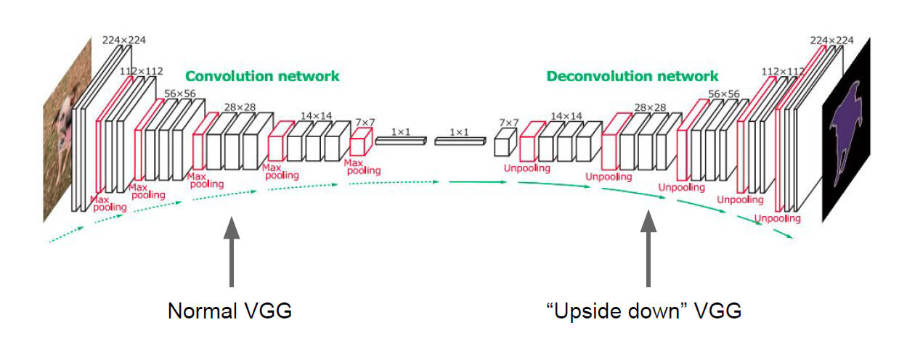
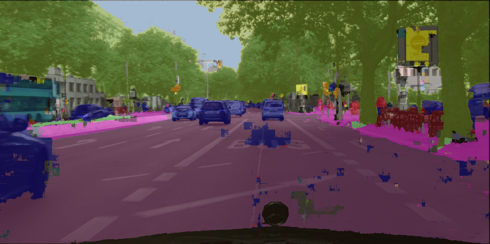

# Semantic Image Segmentation using CNN Architectures

## Idea
Semantic Segmentation of an image is to assign each pixel in the input image a semantic class in order to get a pixel-wise dense classification.

 We have performed the task of semantic segmentation on images from the CityScapes dataset. To go about this task, we have implemented a plethora of CNN architectures to compare performances. The metrics we have used to test our models are pixel accuracy, and Intersection-Over-Union (IOU, Jaccard Index) - explained in detail going ahead. The baseline model we used had 5 convolutional and 5 deconvolutional layers. This was followed by transforming the images to cater to mirror flips, image rotations and crops of different sizes - this ensures scale and rotational invariance. In the next model, we experimented with the number of layers in the CNN architecture and added pooling layers to enhance the performance by ensuring translation invariance. We dealt with the training bias because of different number of classes in the dataset using Dice loss. We eventually shifted our focus to transfer learning by using the pretrained ResNet18 network. Finally, we used the UNet architecture to perform the task of segmentation

## Goal
* To perform semantic segmentation and comprehensive analysis on cityscape dataset using various architecture and techniques.
* Visualization of output on a test image for all the experiments.

## How to use
In "main.py" file:
* set `model_name` to appropriate model name for saving the plot and weights after every epochs.
* set `model` to any of `FCN`, `Resnet18`, `UNET` or your custom model class
* set `epochs` to number of epochs you want to run your network for.
* use `model.apply(init_weights)` when training from scratch or use `model.load_state_dict(torch.load(<path/to/saved/model>))` when using pretrained weights of the same architecture
* set `init_epoch` to the first epoch value for training. It will be zero when starting from scratch otherwise the epoch number
* `early_stop_threshold` can be used to change the creteria for early stopping

For Class imbalance case, Use `main_imbalance.py` and `diceLoss`

## Results
The models have not be training completely due to limited computation available with us at time of training.  
The images presented below are after training 10-15 epochs from scratch. There is a huge scope of improvement in the results with further training. However, the results are sufficient to observe the segmentation and make a comparision between the models. 

### Basic FCN

### VGG16 inspired Encoder

### Tackling Class Imbalance using Dice Loss

### Basic FCN on Augmented Dataset

### Transfer Learning (Resnet18)

### UNet

## Summary

| Model  | Pixel Accuracy | Average IoU|
| ------------- | ------------- | -|
|Basic | 71.1 | 0.57 |
|Augmented Dataset | 91.34 | 0.73 |
|VGG16 inspired architecture | 73.30 | 0.59 |
|Tackling Class Imbalance (Dice Loss) | 76.80 | 0.60|
|Transfer Learning (Resnet18) | 79.21 | 0.65|
|UNet | 82.3 | 0.71 |

