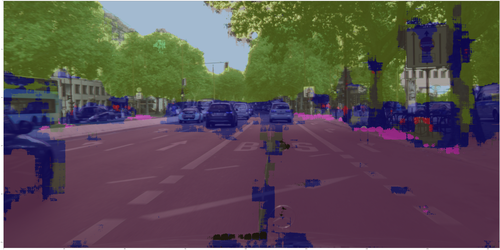
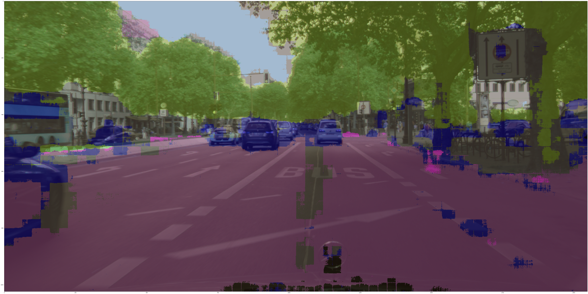
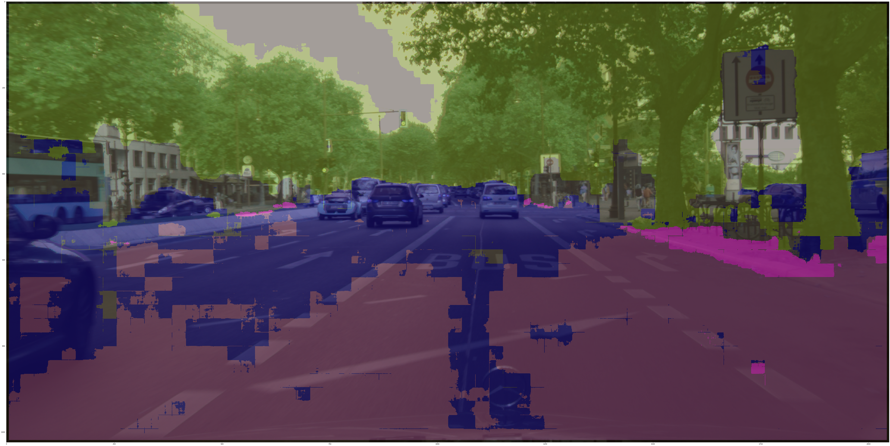
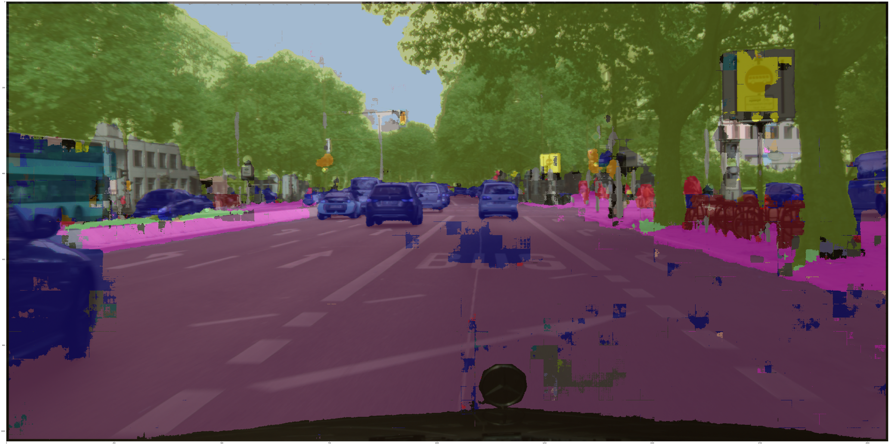
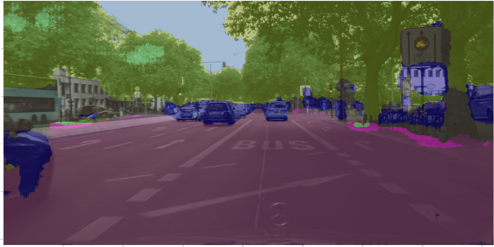

# Semantic Image Segmentation using CNN Architectures

## Idea

## Goal

## How to use
In "main.py" file:
* set `model_name` to appropriate model name for saving the plot and weights after every epochs.
* set `model` to any of `FCN`, `Resnet18`, `UNET` or your custom model class
* set `epochs` to number of epochs you want to run your network for.
* use `model.apply(init_weights)` when training from scratch or use `model.load_state_dict(torch.load(<path/to/saved/model>))` when using pretrained weights of the same architecture
* set `init_epoch` to the first epoch value for training. It will be zero when starting from scratch otherwise the epoch number
* `early_stop_threshold` can be used to change the creteria for early stopping

## Results

### Basic FCN

### VGG16 inspired Encoder

### Tackling Class Imbalance using Dice Loss

### Basic FCN on Augmented Dataset

### Transfer Learning (Resnet18)

### UNet

## Summary

| Model  | Pixel Accuracy | Average IoU|
| ------------- | ------------- | -|
|Basic | 71.1 | 0.57 |
|Augmented Dataset | 91.34 | 0.73 |
|VGG16 inspired architecture | 73.30 | 0.59 |
|Tackling Class Imbalance (Dice Loss) | 76.80 | 0.60|
|Transfer Learning (Resnet18) | 79.21 | 0.65|
|UNet | 82.3 | 0.71 |

